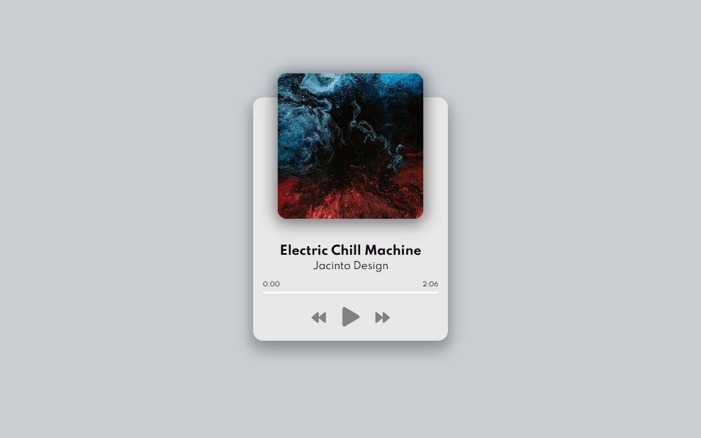

# Music Player | ZTM JS Web Projects Course

**Project 8/20**

🎵 Music Player is a stylish and responsive web audio player built using HTML, CSS, and JavaScript. It allows users to play, pause, skip, and rewind through a playlist with real-time progress tracking and dynamic song updates.

---

## 📚 Table of Contents

- [🔎 Overview](#-overview)
  - [📸 Screenshot](#-screenshot)
  - [🔗 Links](#-links)
  - [📌 Features](#-features)
- [🧠 My process](#-my-process)
  - [🛠️ Built with](#️-built-with)
  - [🎓 What I learned](#-what-i-learned)
  - [🔙 Previous Project](#-previous-project)
  - [🔜 Next Project](#-next-project)
  - [🗃️ Useful resources](#️-useful-resources)
- [👤 Author](#-author)
  - [🌐 Connect with Me](#-connect-with-me)
  - [💻 Coding Profiles](#-coding-profiles)

---

## 🔎 Overview

### 📸 Screenshot

### 🔗 Links

 - [🔴 Live Demo](https://dalascript.github.io/music-player/)
 - [🗂️ GitHub Repository](https://github.com/DalaScript/music-player)

### 📌 Features

  - ✅ Dynamic playlist of multiple songs
  - ✅ Play/Pause toggle with animated icon switching
  - ✅ Next and Previous song navigation
  - ✅ Real-time progress bar with time tracking
  - ✅ Click-to-seek functionality on the progress bar
  - ✅ Auto-switch to next track when current ends
  - ✅ Responsive design and mobile-friendly layout
  - ✅ Smooth UI with album art transitions

---

## 🧠 My Process

### 🛠️ Built with

 - HTML5
 - CSS3 
 - Vanilla JavaScript
 - `<Audio>` API

### 🎓 What I Learned

 - How to use the `<audio>` element and its JavaScript API
 - Managing dynamic playlists with JavaScript objects and arrays
 - DOM manipulation and updating UI in real-time
 - Event listeners for media playback control
 - Calculating and formatting audio time (minutes/seconds)
 - Handling user input for audio scrubbing and interaction

  > 🚀 For me, this project was more about **practice** and gaining additional **experience**,  
  > rather than learning something entirely new.  
  >  
  > 👨‍💻 Since I’m not a beginner and already familiar with these technologies,  
  > I approached it with confidence — and still, I truly **enjoyed working on it**.  
  >  
  > 🎯 Overall, I consider this a very **valuable and enjoyable experience**.

### 🔙 Previous Project

 - Navigation Nation | *[Project 7/20]* → [View Repository](https://github.com/DalaScript/navigation-nation)

### 🔜 Next Project

 - Custom Countdown | *[Project 9/20]* → [View Repository](https://github.com/DalaScript/custom-countdown)

### 🗃️ Useful resources

 - [Google Fonts](https://fonts.google.com/) – Free web fonts for styling text.
 - [FontAwesome Icons](https://fontawesome.com/icons?d=gallery&q=close&m=free) – Icons used for UI controls.
 - [W3Schools - Audio DOM Reference](https://www.w3schools.com/tags/ref_av_dom.asp) – Reference for `<audio>` methods/events.
 - [W3Schools - This](https://www.w3schools.com/js/js_this.asp) – Explains how `this` works in JS.
 - [MDN - Object Fit](https://developer.mozilla.org/en-US/docs/Web/CSS/object-fit) – Resize media inside containers.
 - [MDN - Ternary Operator](https://developer.mozilla.org/en-US/docs/Web/JavaScript/Reference/Operators/Conditional_operator) – Short `if-else` syntax.
 - [MDN - Destructuring](https://developer.mozilla.org/en-US/docs/Web/JavaScript/Reference/Operators/Destructuring) – Extract values from objects/arrays.
 - [MDN - Math Floor](https://developer.mozilla.org/en-US/docs/Web/JavaScript/Reference/Global_Objects/Math/floor) – Round numbers down.
 - [MDN - Math Operators](https://developer.mozilla.org/en-US/docs/Web/JavaScript/Reference/Operators) – JavaScript math basics.
 - [textContent vs innerText](https://developer.mozilla.org/en-US/docs/Web/API/Node/textContent) – Difference between text outputs.

---

## 👤 Author

### 🌐 Connect with Me

 - [Instagram](https://www.instagram.com/DalaScript)
 - [YouTube](https://www.youtube.com/@DalaScript)

### 💻 Coding Profiles

 - [freeCodeCamp](https://www.freecodecamp.org/DalaScript)
 - [FrontendMentor](https://www.frontendmentor.io/profile/DalaScript)
 - [GitHub](https://github.com/DalaScript)

*🙌 Thanks for checking out my project! More coming soon. Stay tuned 🚀*